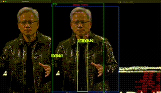

# Reelx
Reelx is an innovative video processing tool designed to convert horizontal videos into multiple variants of vertical videos, optimizing the viewing experience for various platforms and audiences.

# Background
* **The Rise of Vertical Video Content on Smartphones** - In recent years, vertical videos have surged in popularity, primarily driven by the widespread use of smartphones. 

* **Engagement and User Experience** - Users prefer consuming content in a format that fits their device's natural orientation, making vertical videos more engaging and convenient.

* **Many social media favoring Vertical video** - Giving Vertical video  higher visibility and reach. This has encouraged content creators to produce more vertical content to maximize their engagement and growth on these platforms.

## Unique Features:

### AI-Driven Region of Interest (ROI) Adjustment:

Utilizes advanced artificial intelligence to identify and adjust the region of interest within the video. This ensures that the most important elements are centered and prominent in the vertical format, enhancing viewer engagement.


### Dynamic People Tracking:

Implements sophisticated people tracking algorithms to dynamically adjust the region of interest based on the movement of individuals within the video. This maintains focus on key subjects, ensuring they remain the center of attention.



### Tiled View for Podcast Videos:

Creates a tiled view layout specifically designed for podcast videos, allowing multiple speakers or participants to be visible simultaneously. The layout intelligently switches to highlight the active speaker, providing a seamless viewing experience.


### No-Loss Frame with Zoomed View:

Generates a no-loss frame with a zoomed-in view presented in a tiled fashion. Users have the flexibility to customize the position of the no-loss frame, ensuring that critical content is never missed and can be highlighted as needed.


## Getting started

## Installation

This solution offers multiple installation methods. Please review the detailed steps below and choose the installation approach that best suits your needs.

```markdown
1. Source Installation
2. Conda Environment Installation
```

### 1. Source Installation

#### Prerequisite 

1. Python version 3.12.6 or higher

2. Verify python installation

```bash
python --version
```

#### Installation Instructions

1. Clone the **Reelix** source repository usign below command

```
git clone https://github.com/Fikyo/Reelx

```

2. Traverse to the directory `src` using command `cd src`

3. install all required packages

```
pip install -r requirements.txt
```

4. execute the command below to check if the installation is successful.

```
python reelx.py -h
```

5. The command will display all available options for converting horizontal video to vertical video format.

```markdown
usage: reframer [-h] [--model_type MODEL_TYPE] [--model_verbose MODEL_VERBOSE] [--mode MODE]
                   [--output OUTPUT] [--confidence CONFIDENCE] [--smoothing SMOOTHING]
                   [--preview_vertical_video PREVIEW_VERTICAL_VIDEO]
                   [--preview_debug_player PREVIEW_DEBUG_PLAYER]
                   [--enable_tiled_frame ENABLE_TILED_FRAME] [--person_model PERSON_MODEL]
                   [--process_noloss_frame PROCESS_NOLOSS_FRAME]
                   [--noloss_tiled_position NOLOSS_TILED_POSITION]
                   input_video
```

### 2. Conda Environment Installation

#### Prerequisite 

1. Install [Anaconda](https://docs.anaconda.com/anaconda/install/)

#### Installation Instructions

1. Create Conda environment for python 3.12.6 using below ommand

```
conda create -n reelix python=3.12.6
```

2. Activate the conda environment `reelix`

```
conda activate reelix
```

3. Follow the either of [#1](#1-source-installation) installation methods.
